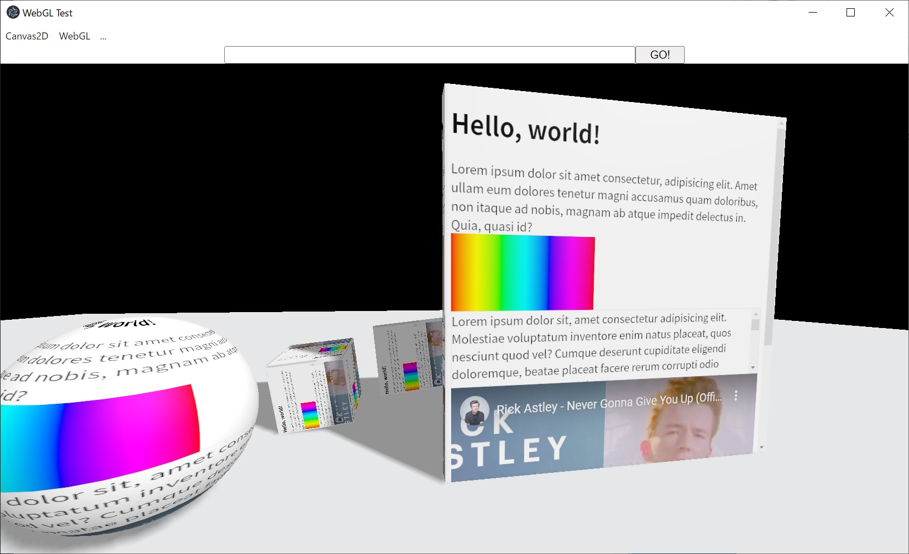

# electron-canvas-webview
This is a project to try transferring off-screen web contents to Canvas2D and WebGL.

オフスクリーンで描画した Web コンテンツの画像を Canvas2D や WebGL に転送してみるプロジェクトです。
拒否された WebGL 拡張機能、[WEBGL_texture_source_iframe](https://registry.khronos.org/webgl/extensions/rejected/WEBGL_texture_source_iframe/) を再現したかった。

<br>



<br>

---
<br>

## 機能
- レンダリング プロセスへの更新の通知と画像の転送
- 複数の WebView 作成
- マウスとキーボードの入力をオフスクリーンのブラウザーに転送
- マウス カーソルの形状をレンダリング プロセスへ通知

## ビルド
```
$ git clone https://github.com/inonote/electron-canvas-webview
$ cd electron-canvas-webview
$ npm install
$ npm start
```

## TODO
- オフスクリーンのプロセスを終了できない問題
  - 他の全てのブラウザー ウィンドウも閉じてしまう

## LICENSE
MIT
